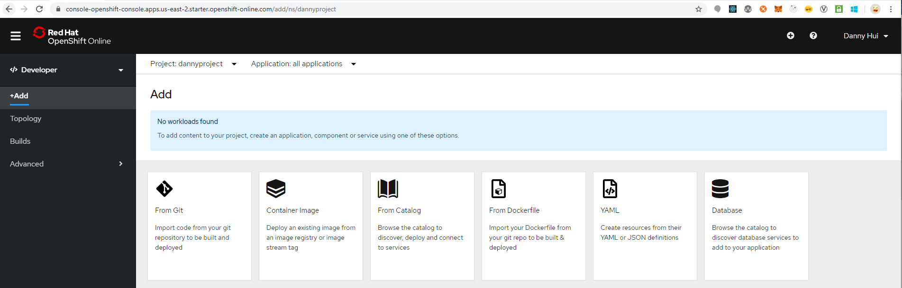
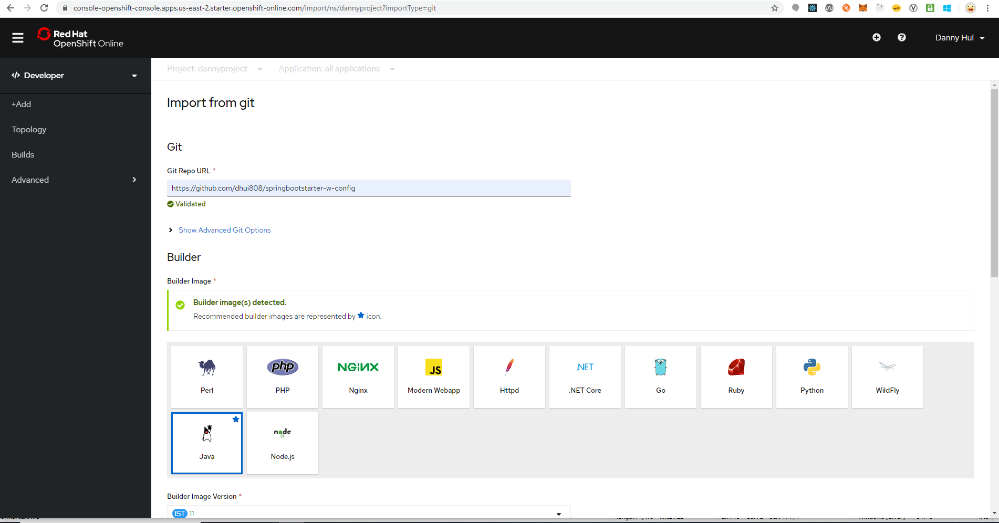
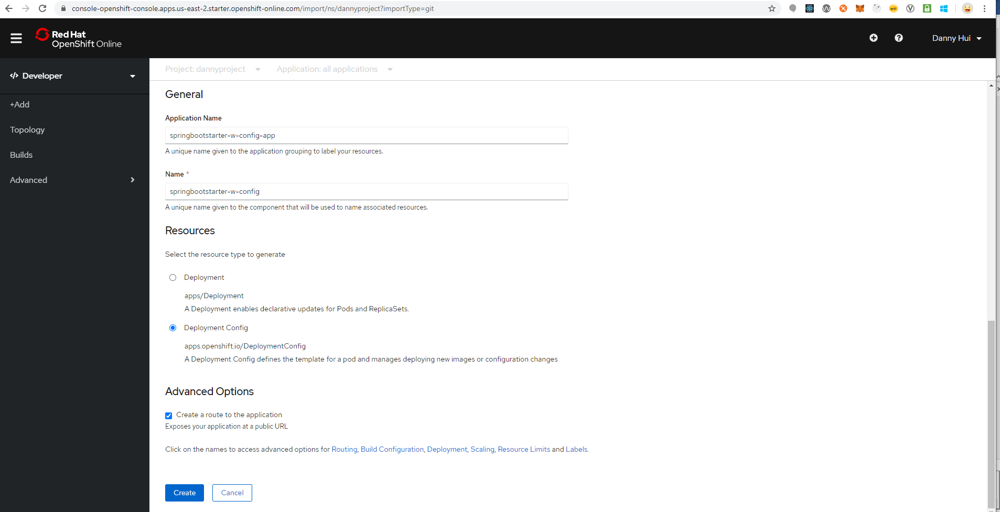
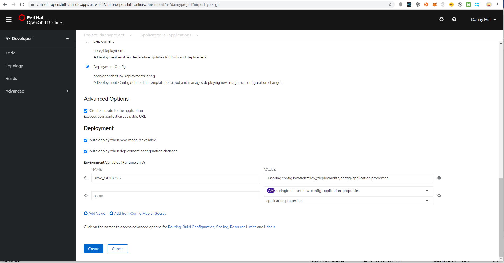
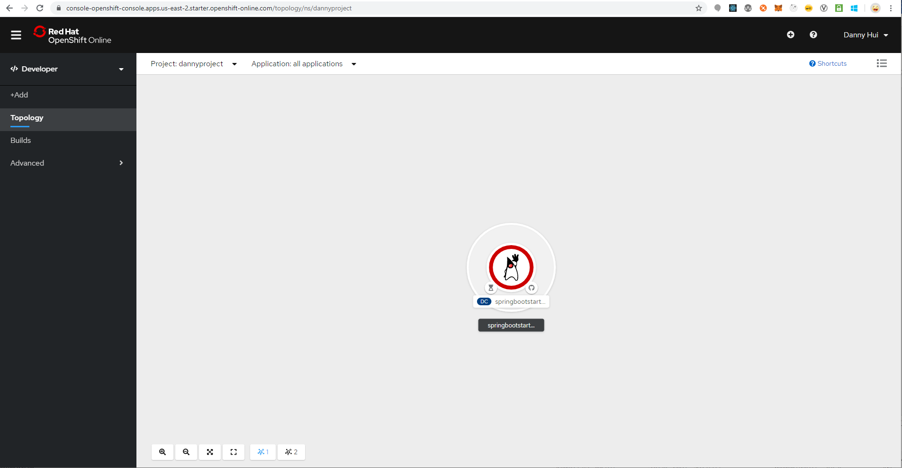
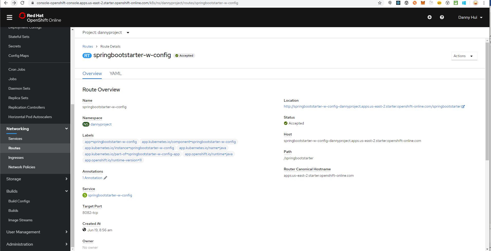

# Deploy Spring Boot Web Application with external configuration files from OpenShift Web Console

Source:
<https://github.com/dhui808/springbootstarter-w-config>

**Create ConfigMap from oc**

oc create configmap springbootstarter-w-config-application-properties
\--from-file=/springbootstarter-w-config/config/application.properties

configmap/springbootstarter-w-config-application-properties created

**OpenShift Web Console**

Developer Perspective

+Add

From Git

Git repo URL

https://github.com/dhui808/springbootstarter-w-config

Builder Image

Java

Select Deployment Config

Click Routing (not providing routing configuration?)

Click Deployment

Environment Variables (Runtime only)

NAME

JAVA\_OPTIONS

VALUE

-Dspring.config.location=file:///deployments/config/application.properties

Click Add from ConfigMap or Secret

Select a resource

springbootstarter-w-config-application-properties

Select a key

application.properties

Create

**Add Volume and Volume Mount from oc**

(springbootstarter-w-config is the name of the newly-created Deployment
Config)

oc set volume dc/springbootstarter-w-config \--add \--name volume-config
-t configmap \--configmap-name
springbootstarter-w-config-application-properties -m /deployments/config
-o yaml

**Administrator Perspective**

Workloads -- Deployment Configs - springbootstarter-w-config -- YAML

containerPort: 8082

\- containerPort: 8082

Save

Networking -- Services - springbootstarter-w-config - YAML

Under spec -- ports

\- name: 8082-tcp

protocol: TCP

port: 8082

targetPort: 8082

Save

Networking -- Routes - springbootstarter-w-config - YAML

Under spec

port:

targetPort: 8082-tcp

path: /springbootstarter

Save

**Browser**

<http://springbootstarter-w-config-dannyproject.apps.us-east-2.starter.openshift-online.com/springbootstarter/hello>

Voila!
