**Deploy Spring Boot Web Application**

**from OpenShift Web Console**

Login to OpenShift 4.4

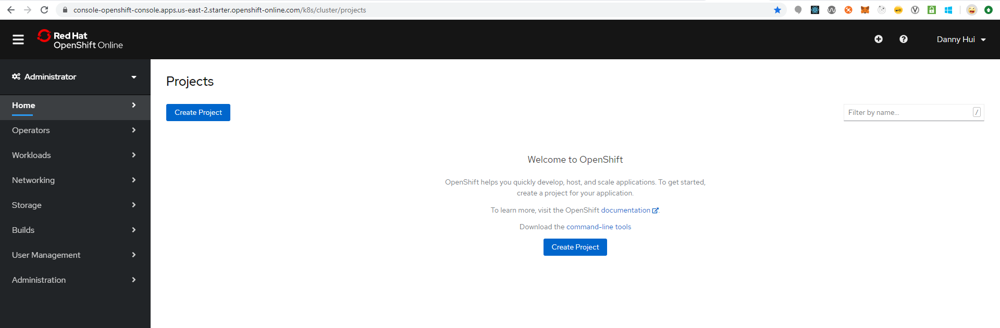{width="6.5in" height="2.1375in"}

Create Project

MyProject

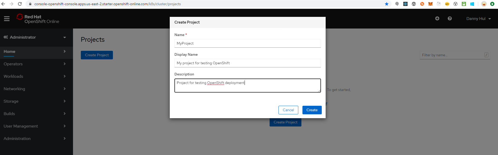{width="6.5in" height="2.035416666666667in"}

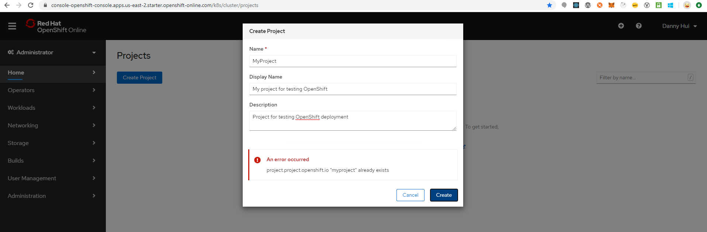{width="6.5in" height="2.1430555555555557in"}

Obviously, OpenShift requires a project name unique across OpenShift --
this is nonsense. Should be cluster-wide unique only.

MyFirstProject

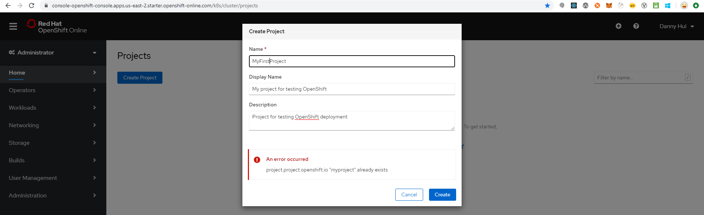{width="6.5in" height="1.9909722222222221in"}

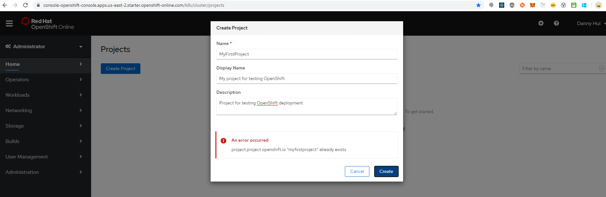{width="6.5in" height="2.1173611111111112in"}

DannyProject

Dashboard

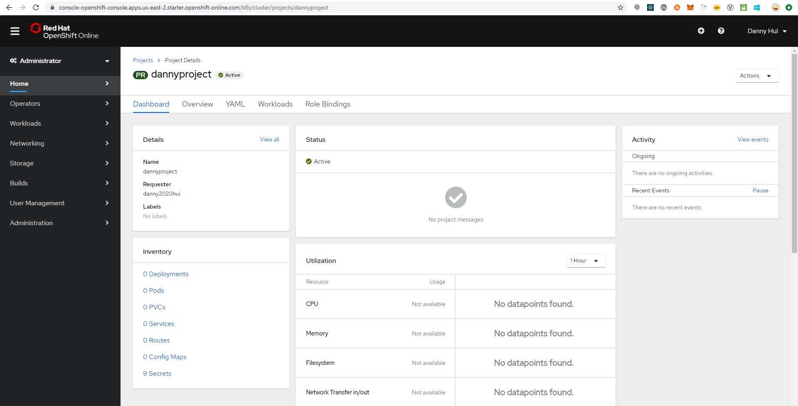{width="6.5in" height="3.314583333333333in"}

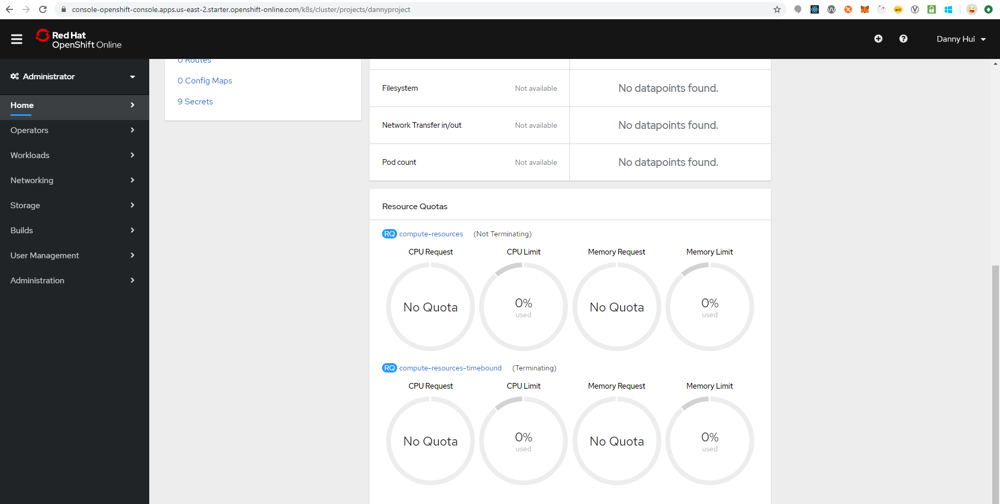{width="6.5in" height="3.277083333333333in"}

Overview

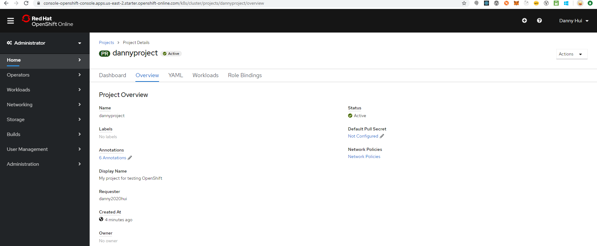{width="6.5in" height="2.6909722222222223in"}

YAML

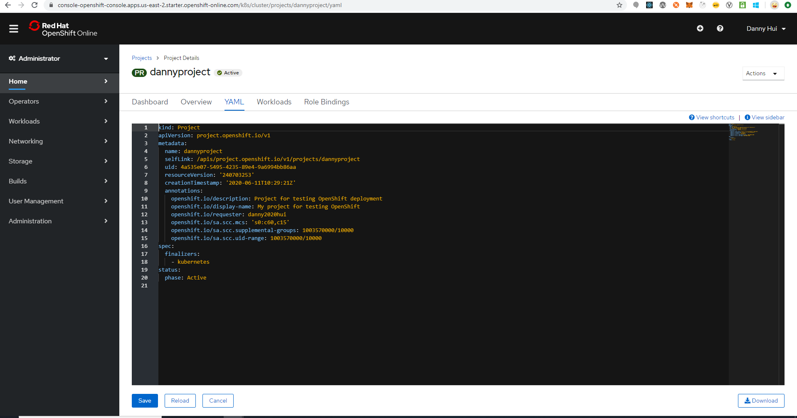{width="6.5in" height="3.407638888888889in"}

Workloads

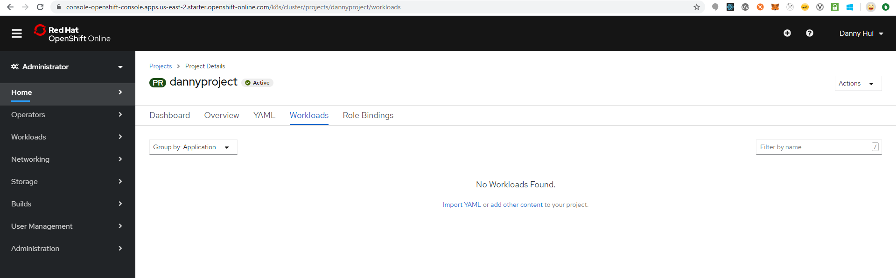{width="6.5in" height="2.0243055555555554in"}

Roles Bindings

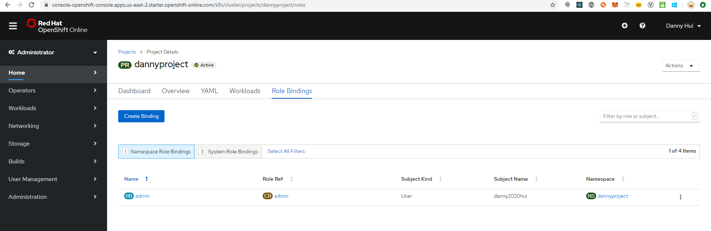{width="6.5in" height="2.1166666666666667in"}

Home -- Projects

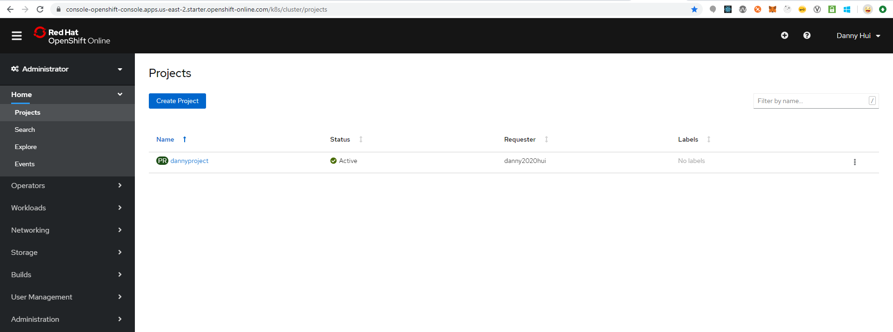{width="6.5in" height="2.4208333333333334in"}

Developer Perspective

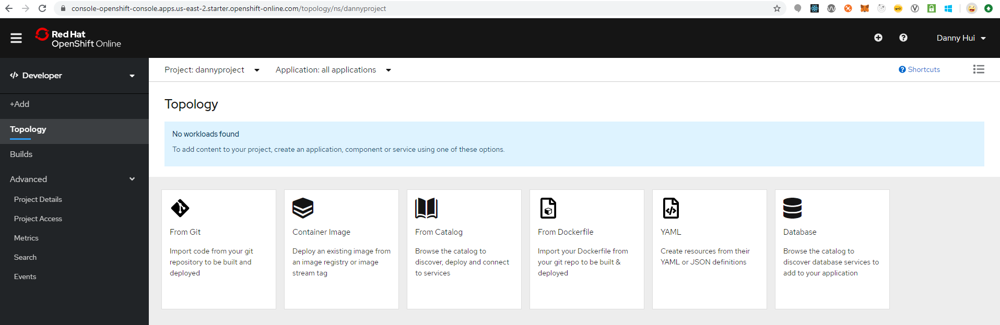{width="6.5in" height="2.1145833333333335in"}

Deploy Spring Boot Web Application

Source: C:\\Users\\danny.hui\\research\\openshift\\springbootstarter

<https://github.com/dhui808/springbootstarter>

+Add

{width="6.5in" height="2.0527777777777776in"}

From Git

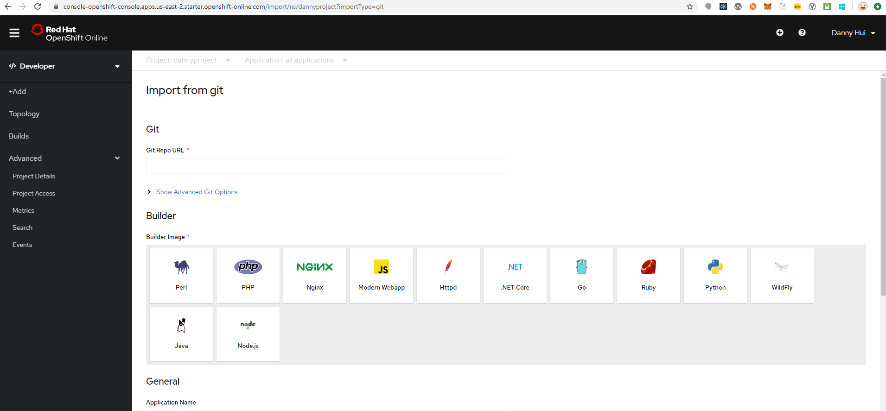{width="6.5in" height="3.0166666666666666in"}

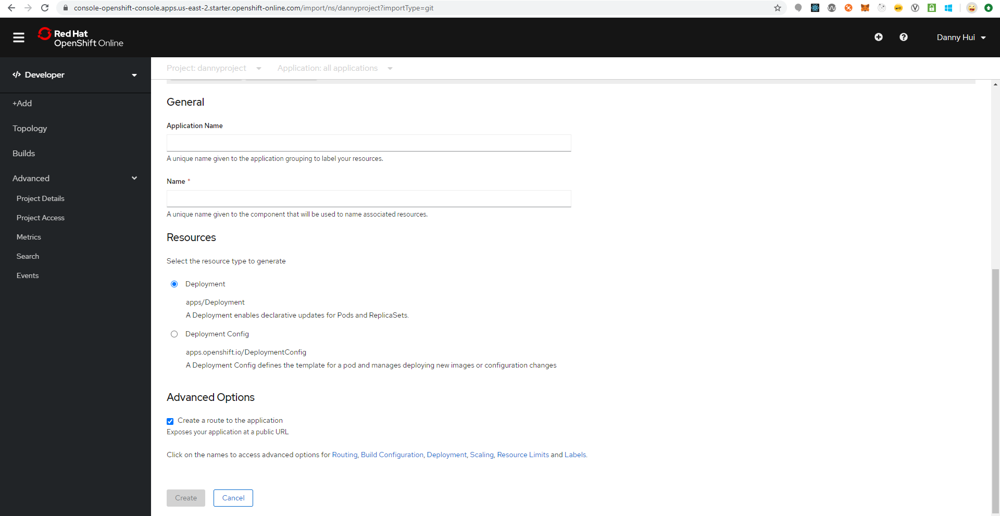{width="6.5in" height="3.354861111111111in"}

Show Advanced Git Options

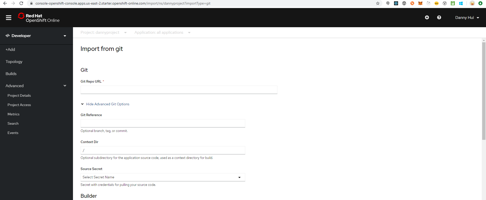{width="6.5in" height="2.6909722222222223in"}

Git Repo URL

<https://github.com/dhui808/springbootstarter>

Build Image

Java

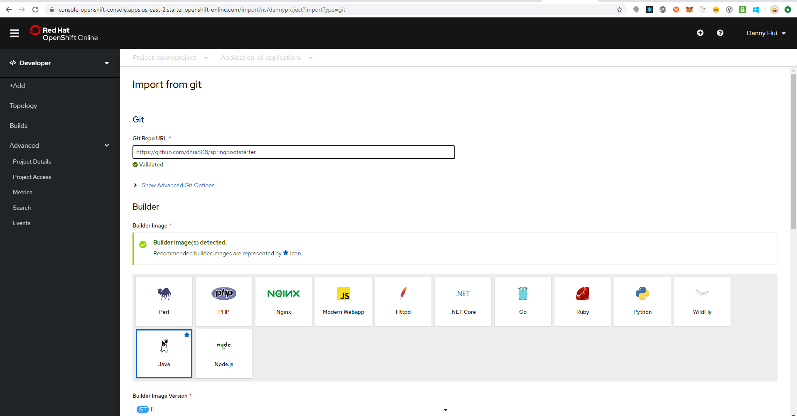{width="6.5in" height="3.39375in"}

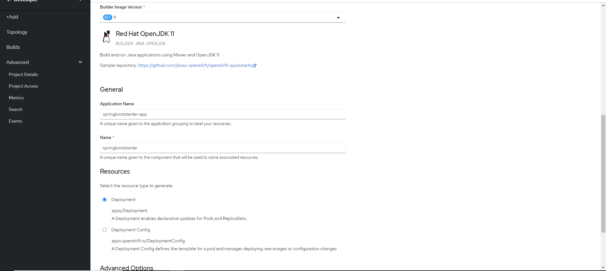{width="6.5in" height="2.917361111111111in"}

{width="6.5in" height="0.8965277777777778in"}

Select either Deployment (OpenShift recommendation) or Deployment Config
(allowing adding volume)

Create

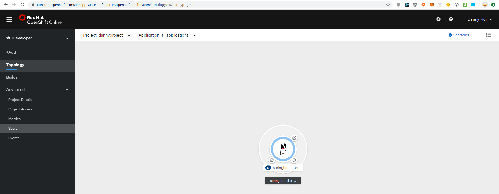{width="6.5in" height="2.532638888888889in"}

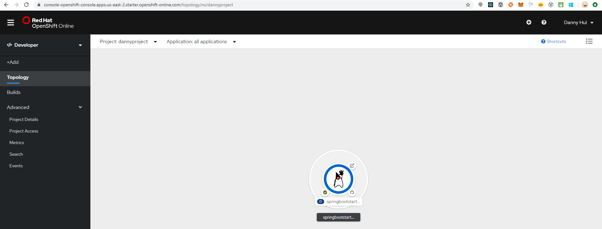{width="6.5in" height="2.4770833333333333in"}

List View

{width="6.5in" height="2.4770833333333333in"}

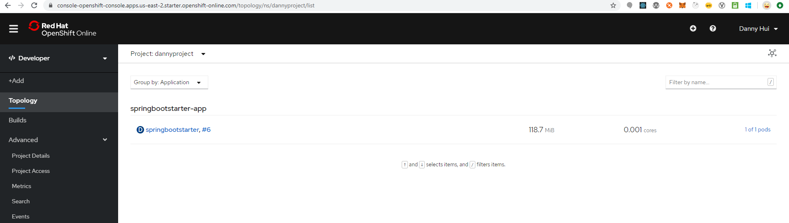{width="6.5in" height="1.8409722222222222in"}

springbootstarter

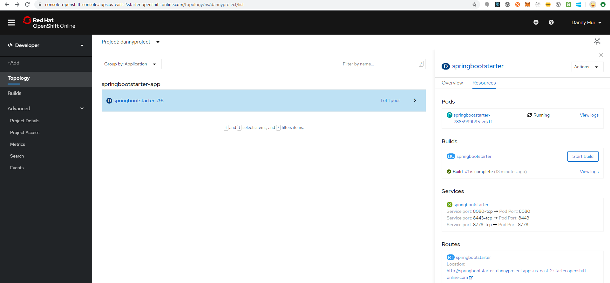{width="6.5in" height="3.0166666666666666in"}

View Logs

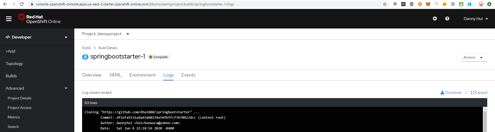{width="6.5in" height="1.7416666666666667in"}

Cloning \"https://github.com/dhui808/springbootstarter\" \...

Commit: df1efa5531adad3ab0234e56fbffcf3b70623dcc (context root)

Author: dannyhui \<huichunwuca\@yahoo.com\>

Date: Sat Jun 6 22:24:56 2020 -0400

ntral:
https://repo1.maven.org/maven2/net/java/dev/jna/jna-platform/5.5.0/jna-platform-5.5.0.jar
(2.7 MB at 14 MB/s)

\[INFO\] Downloading from central:
https://repo1.maven.org/maven2/org/sonatype/sisu/sisu-guice/3.2.5/sisu-guice-3.2.5-no\_aop.jar

\[INFO\] Downloaded from central:
https://repo1.maven.org/maven2/org/codehaus/plexus/plexus-component-annotations/1.5.5/plexus-component-annotations-1.5.5.jar
(4.2 kB at 25 kB/s)

\[INFO\] Downloading from central:
https://repo1.maven.org/maven2/com/google/guava/guava/16.0.1/guava-16.0.1.jar

\[INFO\] Downloaded from central:
https://repo1.maven.org/maven2/org/sonatype/sisu/sisu-inject-plexus/2.6.0/sisu-inject-plexus-2.6.0.jar
(20 kB at 97 kB/s)

\[INFO\] Downloading from central:
https://repo1.maven.org/maven2/org/apache/maven/shared/maven-shared-utils/3.1.0/maven-shared-utils-3.1.0.jar

\[INFO\] Downloaded from central:
https://repo1.maven.org/maven2/org/sonatype/plexus/plexus-sec-dispatcher/1.4/plexus-sec-dispatcher-1.4.jar
(28 kB at 134 kB/s)

\[INFO\] Downloading from central:
https://repo1.maven.org/maven2/org/apache/maven/maven-plugin-api/3.6.3/maven-plugin-api-3.6.3.jar

\[INFO\] Downloaded from central:
https://repo1.maven.org/maven2/org/sonatype/sisu/sisu-inject-bean/2.6.0/sisu-inject-bean-2.6.0.jar
(45 kB at 205 kB/s)

\[INFO\] Downloading from central:
https://repo1.maven.org/maven2/org/eclipse/sisu/org.eclipse.sisu.plexus/0.3.4/org.eclipse.sisu.plexus-0.3.4.jar

\[INFO\] Downloaded from central:
https://repo1.maven.org/maven2/org/sonatype/sisu/sisu-guice/3.2.5/sisu-guice-3.2.5-no\_aop.jar
(400 kB at 1.8 MB/s)

\[INFO\] Downloading from central:
https://repo1.maven.org/maven2/javax/enterprise/cdi-api/1.0/cdi-api-1.0.jar

\[INFO\] Downloaded from central:
https://repo1.maven.org/maven2/org/apache/maven/maven-plugin-api/3.6.3/maven-plugin-api-3.6.3.jar
(47 kB at 201 kB/s)

\[INFO\] Downloading from central:
https://repo1.maven.org/maven2/javax/annotation/jsr250-api/1.0/jsr250-api-1.0.jar

\[INFO\] Downloaded from central:
https://repo1.maven.org/maven2/org/apache/maven/shared/maven-shared-utils/3.1.0/maven-shared-utils-3.1.0.jar
(164 kB at 691 kB/s)

\[INFO\] Downloading from central:
https://repo1.maven.org/maven2/org/eclipse/sisu/org.eclipse.sisu.inject/0.3.4/org.eclipse.sisu.inject-0.3.4.jar

\[INFO\] Downloaded from central:
https://repo1.maven.org/maven2/javax/enterprise/cdi-api/1.0/cdi-api-1.0.jar
(45 kB at 177 kB/s)

\[INFO\] Downloading from central:
https://repo1.maven.org/maven2/org/codehaus/plexus/plexus-utils/3.2.1/plexus-utils-3.2.1.jar

\[INFO\] Downloaded from central:
https://repo1.maven.org/maven2/org/eclipse/sisu/org.eclipse.sisu.plexus/0.3.4/org.eclipse.sisu.plexus-0.3.4.jar
(205 kB at 796 kB/s)

\[INFO\] Downloading from central:
https://repo1.maven.org/maven2/org/codehaus/plexus/plexus-classworlds/2.6.0/plexus-classworlds-2.6.0.jar

\[INFO\] Downloaded from central:
https://repo1.maven.org/maven2/javax/annotation/jsr250-api/1.0/jsr250-api-1.0.jar
(5.8 kB at 23 kB/s)

\[INFO\] Downloaded from central:
https://repo1.maven.org/maven2/com/google/guava/guava/16.0.1/guava-16.0.1.jar
(2.2 MB at 8.3 MB/s)

\[INFO\] Downloaded from central:
https://repo1.maven.org/maven2/org/eclipse/sisu/org.eclipse.sisu.inject/0.3.4/org.eclipse.sisu.inject-0.3.4.jar
(379 kB at 1.4 MB/s)

\[INFO\] Downloaded from central:
https://repo1.maven.org/maven2/org/codehaus/plexus/plexus-classworlds/2.6.0/plexus-classworlds-2.6.0.jar
(53 kB at 166 kB/s)

\[INFO\] Downloaded from central:
https://repo1.maven.org/maven2/org/codehaus/plexus/plexus-utils/3.2.1/plexus-utils-3.2.1.jar
(262 kB at 818 kB/s)

\[INFO\] Replacing main artifact with repackaged archive

\[INFO\]
\-\-\-\-\-\-\-\-\-\-\-\-\-\-\-\-\-\-\-\-\-\-\-\-\-\-\-\-\-\-\-\-\-\-\-\-\-\-\-\-\-\-\-\-\-\-\-\-\-\-\-\-\-\-\-\-\-\-\-\-\-\-\-\-\-\-\-\-\-\-\--

\[INFO\] BUILD SUCCESS

\[INFO\]
\-\-\-\-\-\-\-\-\-\-\-\-\-\-\-\-\-\-\-\-\-\-\-\-\-\-\-\-\-\-\-\-\-\-\-\-\-\-\-\-\-\-\-\-\-\-\-\-\-\-\-\-\-\-\-\-\-\-\-\-\-\-\-\-\-\-\-\-\-\-\--

\[INFO\] Total time: 21.791 s

\[INFO\] Finished at: 2020-06-11T11:33:33Z

\[INFO\]
\-\-\-\-\-\-\-\-\-\-\-\-\-\-\-\-\-\-\-\-\-\-\-\-\-\-\-\-\-\-\-\-\-\-\-\-\-\-\-\-\-\-\-\-\-\-\-\-\-\-\-\-\-\-\-\-\-\-\-\-\-\-\-\-\-\-\-\-\-\-\--

\[WARNING\] The requested profile \"openshift\" could not be activated
because it does not exist.

INFO Copying deployments from target to /deployments\...

\'/tmp/src/target/springbootstarter-0.0.1.jar\' -\>
\'/deployments/springbootstarter-0.0.1.jar\'

STEP 9: CMD /usr/local/s2i/run

STEP 10: COMMIT
temp.builder.openshift.io/dannyproject/springbootstarter-1:666d7b7b

Getting image source signatures

Copying blob
sha256:d36cbe2189eee00ed8ca8fe17d5894e2a6caf033c379c20d5b07713d125b8dc6

Copying blob
sha256:ac22a347ac5d9884944bea9c8af6095d120459af968d14b7fffed52c18a5f1a3

Copying blob
sha256:866a160adfee45a957908a361602ffe00a6c604522b5657b9d3b8290595e9762

Copying blob
sha256:c983ce6b869d99f2f1d6614a344a6f5eb452cc99205b608b9ada2f6d7ad8b08a

Copying config
sha256:6865d4747dd63cd2027bc696e3d37cd8c47972a57412d6186613628c42097b52

Writing manifest to image destination

Storing signatures

6865d4747dd63cd2027bc696e3d37cd8c47972a57412d6186613628c42097b52

6865d4747dd63cd2027bc696e3d37cd8c47972a57412d6186613628c42097b52

Pushing image
image-registry.openshift-image-registry.svc:5000/dannyproject/springbootstarter:latest
\...

Getting image source signatures

Copying blob
sha256:c983ce6b869d99f2f1d6614a344a6f5eb452cc99205b608b9ada2f6d7ad8b08a

Copying blob
sha256:51e9f237b750efcda2d5755785cdb8dd080d51585ae35d368e4f9b29a11b1994

Copying blob
sha256:0bf63f6bfea73e8ea01220862087cf57c5eeedfea1218feb575f8834a36c805f

Copying blob
sha256:6c85ac87d44df4b64d7c273886fc5aed55a28422df33dcb641884ffa419db218

Copying config
sha256:6865d4747dd63cd2027bc696e3d37cd8c47972a57412d6186613628c42097b52

Writing manifest to image destination

Storing signatures

Successfully pushed
image-registry.openshift-image-registry.svc:5000/dannyproject/springbootstarter\@sha256:3c6fe16df35bfc87845fc5e348cbf79544342027ac2152004fbf1ae88d240c73

Push successful

Topology -- List View

\#6

\-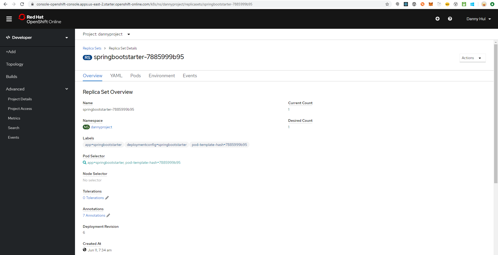{width="6.5in" height="3.332638888888889in"}

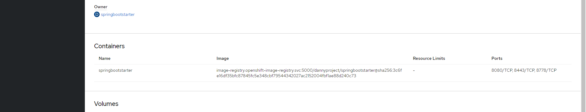{width="6.5in" height="1.2513888888888889in"}

Logs

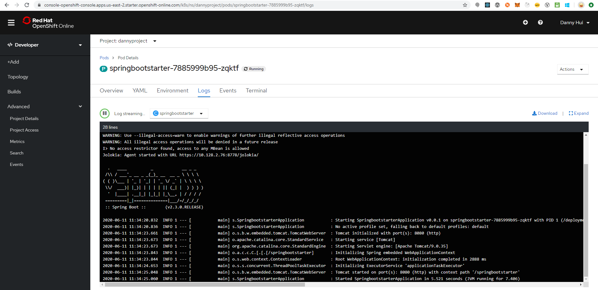{width="6.5in" height="3.165277777777778in"}

From browser:

<http://springbootstarter-dannyproject.apps.us-east-2.starter.openshift-online.com/springbootstarter/hello>

{width="6.5in" height="0.30833333333333335in"}

Voila!

**Deploy Spring Boot Web Application with external configuration files**

**from OpenShift Web Console**

Source:
C:\\Users\\danny.hui\\research\\openshift\\springbootstarter-w-config

<https://github.com/dhui808/springbootstarter-w-config>

**Create ConfigMap from oc**

oc create configmap springbootstarter-w-config-application-properties
\--from-file=/springbootstarter-w-config/config/application.properties

configmap/springbootstarter-w-config-application-properties created

**OpenShift Web Console**

Developer Perspective

+Add

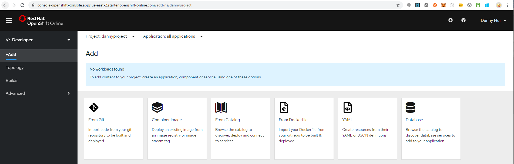{width="6.5in" height="2.079861111111111in"}

From Git

Git repo URL

https://github.com/dhui808/springbootstarter-w-config

Builder Image

Java

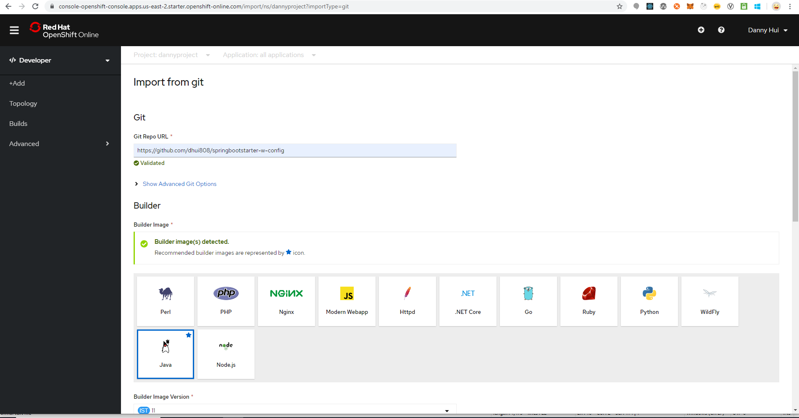{width="6.5in" height="3.4034722222222222in"}

Select Deployment Config

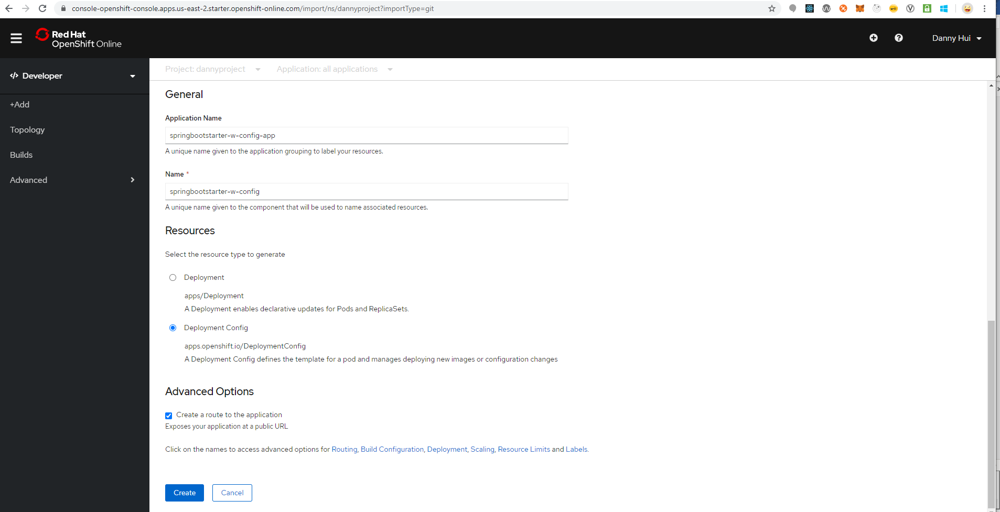{width="6.5in" height="3.329861111111111in"}

Click Routing (not providing routing configuration?)

Click Deployment

Environment Variables (Runtime only)

NAME

JAVA\_OPTIONS

VALUE

-Dspring.config.location=file:///deployments/config/application.properties

Click Add from ConfigMap or Secret

Select a resource

springbootstarter-w-config-application-properties

Select a key

application.properties

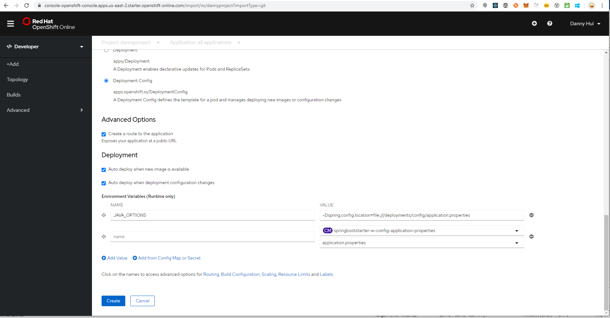{width="6.5in" height="3.3965277777777776in"}

Create

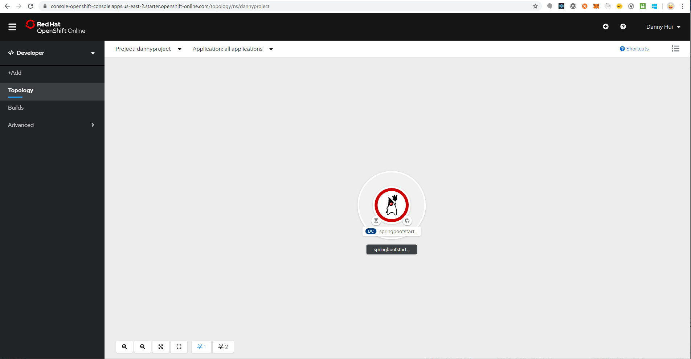{width="6.5in" height="3.376388888888889in"}

**Add Volume and Volume Mount from oc**

(springbootstarter-w-config is the name of the newly-created Deployment
Config)

oc set volume dc/springbootstarter-w-config \--add \--name volume-config
-t configmap \--configmap-name
springbootstarter-w-config-application-properties -m /deployments/config
-o yaml

**Administrator Perspective**

Workloads -- Deployment Configs - springbootstarter-w-config -- YAML

containerPort: 8082

\- containerPort: 8082

Save

Networking -- Services - springbootstarter-w-config - YAML

Under spec -- ports

\- name: 8082-tcp

protocol: TCP

port: 8082

targetPort: 8082

Save

Networking -- Routes - springbootstarter-w-config - YAML

Under spec

port:

targetPort: 8082-tcp

path: /springbootstarter

Save

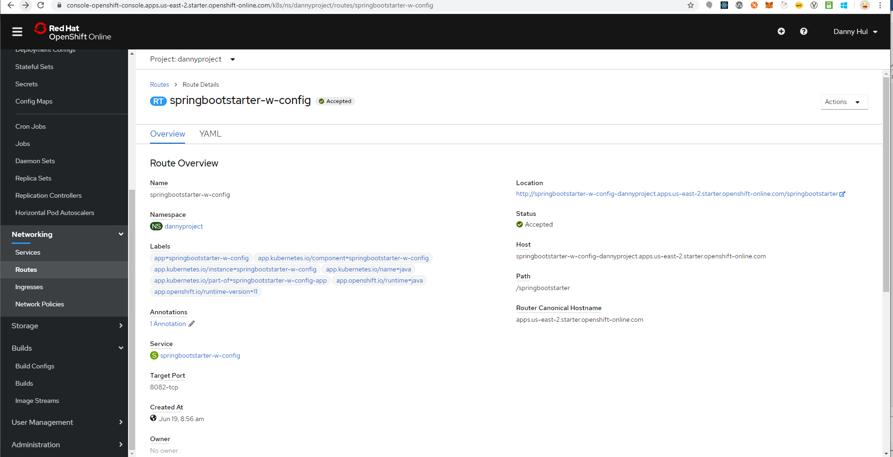{width="6.5in" height="3.3333333333333335in"}

**Browser**

<http://springbootstarter-w-config-dannyproject.apps.us-east-2.starter.openshift-online.com/springbootstarter/hello>

{width="6.5in" height="0.3298611111111111in"}

Voila!
