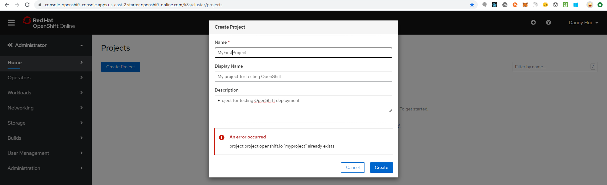
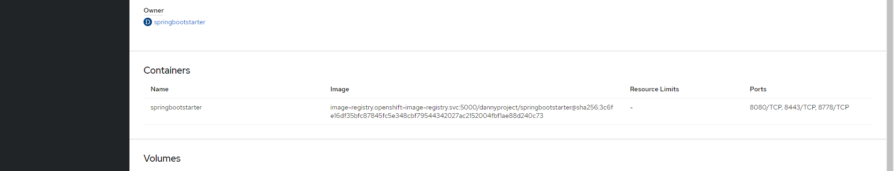

# Deploy Spring Boot Web Application from OpenShift Web Console

Login to OpenShift 4.4

Create Project

MyProject

Obviously, OpenShift requires a project name unique across OpenShift --
this is nonsense. Should be cluster-wide unique only.

MyFirstProject

DannyProject

Dashboard

Overview

YAML

Workloads

Roles Bindings

Home -- Projects

Developer Perspective

Deploy Spring Boot Web Application

Source:

<https://github.com/dhui808/springbootstarter>

+Add

From Git

Show Advanced Git Options

Git Repo URL

<https://github.com/dhui808/springbootstarter>

Build Image

Java

Select either Deployment (OpenShift recommendation) or Deployment Config
(allowing adding volume)

Create

List View

springbootstarter

View Logs

Topology -- List View

Logs

From browser:

<http://springbootstarter-dannyproject.apps.us-east-2.starter.openshift-online.com/springbootstarter/hello>

Voila!
